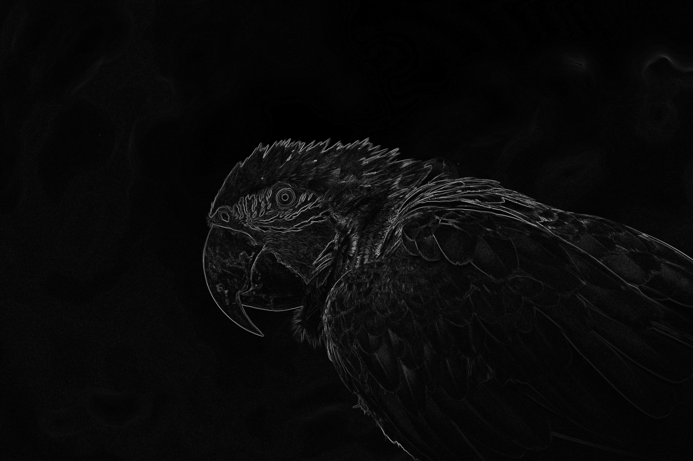

# Parallel Sobel Edge Detector
This is the combination of [342pr1](https://github.com/He-Is-HaZaRdOuS/342pr1) and [342pr2](https://github.com/He-Is-HaZaRdOuS/342pr2) codebases. </br> </br>

# About
This project aims to use MPI, OpenMP and CUDA to speed up image processing algorithms, specifically focusing on edge detection.
All the executables produce the same image pixel-wise.

# Screenshots
### Reference Image


### Processed Image


# Disclaimer!
CMake does not recognize non-english characters in the build path. </br>
If your computer's file structure contains any non-english characters then you won't be able to compile the program. </br>
Please place the project folder somewhere such that the absolute path to it won't contain any non-english characters. </br>

## Installing CMake

##### Option 1
Install CMake from your distribution's package manager

##### Option 2
Open a terminal window and execute the following commands line by line </br>

```bash
 version=3.28
 build=1
 limit=3.20
 result=$(echo "$version >= $limit" | bc -l)
 os=$([ "$result" == 1 ] && echo "linux" || echo "Linux")
 mkdir ~/temp
 cd ~/temp
 wget https://cmake.org/files/v$version/cmake-$version.$build-$os-x86_64.sh
 sudo mkdir /opt/cmake
 sudo sh cmake-$version.$build-$os-x86_64.sh --prefix=/opt/cmake #(Type "y" to accept the license agreement and type "n" to forego installing inside the subdirectory)
 cmake --version #(expected output is "cmake version 3.28.1")
```

## Installing MPI
##### Option 1
Install OpenMPI from your distribution's package manager

##### Option 2
https://docs.open-mpi.org/en/v5.0.x/installing-open-mpi/quickstart.html

## Installing OpenMP
A recent version of gcc/g++ from your distribution's package manager should suffice

## Installing CUDA
https://docs.nvidia.com/cuda/cuda-installation-guide-linux/

## Compilation
open a terminal window and cd into the project folder </br>

#### (Release)
```bash
 mkdir build-release
 cd build-release
 cmake -DCMAKE_BUILD_TYPE=Release ..
 cmake --build .
```

#### (Debug)
```bash
 mkdir build-debug
 cd build-debug
 cmake -DCMAKE_BUILD_TYPE=Debug ..
 cmake --build .
```

the executable will be generated inside the respective build-X folder. </br>
Release preset uses -O2 flag whereas the Debug preset uses the default optimization flag and enables debug symbols. </br>

## Running
To run the sequential executable, open a terminal window and type </br>
```bash
./sequential <INPUT> <OUTPUT>
```
To run the parallel MPI executable, open a terminal window and type </br>
```bash
mpirun -n <THREAD_COUNT> ./mpi <INPUT> <OUTPUT> <ALTERNATE_SEQUENTIAL_OUTPUT>
```

To run the parallel OMP executable, open a terminal window and type </br>
```bash
./omp <INPUT> <OUTPUT> <THREAD_COUNT> <ALTERNATE_SEQUENTIAL_OUTPUT>
```
To run the parallel CUDA executable, open a terminal window and type </br>
```bash
./cuda <INPUT> <OUTPUT> <SP_THREADS_PER_BLK> <ALTERNATE_SEQUENTIAL_OUTPUT>
```

The following explains the arguments and their format.
* INPUT: Name of input image file
* OUTPUT: Name of output image file
* ALTERNATE_SEQUENTIAL_OUTPUT: Name of the output image file from the sequential program
* THREAD_COUNT: Number of cores/threads to allocate to the program
* SP_THREADS_PER_BLK: Number of SP threads to allocate to each SP Block (CUDA Only)
</br>
